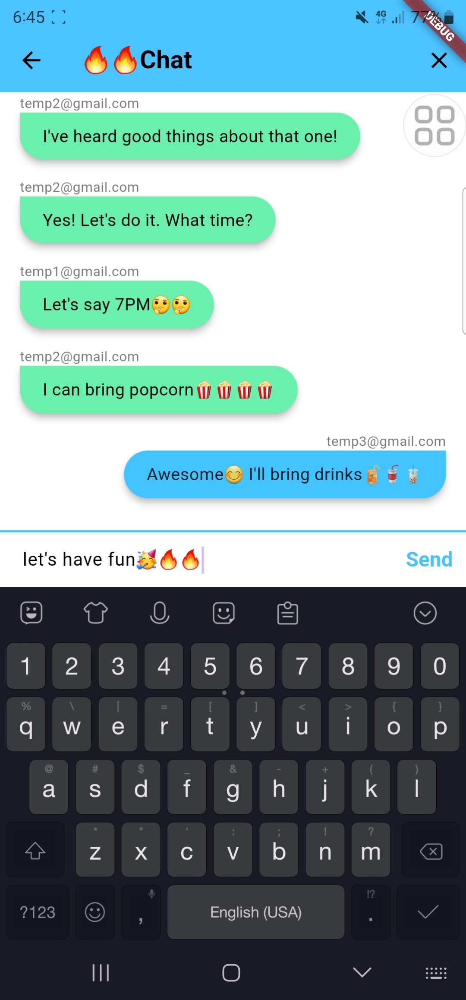

# *******ChatMate*******

## Overview

This project is a **ChatMate(Flutter-based real-time chat application)** that utilizes **Firebase** for user authentication, real-time message storage, and synchronization. Designed with a focus on simplicity and user-friendliness, this chat application allows users to seamlessly log in, register, and join group chat rooms, making it a great foundation for more complex messaging applications. 

The app includes a robust, structured, and reusable codebase organized across multiple Dart files, including screens for login, registration, welcome, and chat functionalities. Custom widgets and constants are employed for a cohesive and maintainable UI experience, following Flutter's Material Design guidelines.

## Screenshots

  
  
  
  
  
  
  
  
  
  

## Features

### 1. **User Authentication**  
   - **Firebase Authentication**: Users can register and log in using Firebase's secure email and password authentication system.
   - **Login and Registration Screens**: User-friendly forms to capture credentials, with error handling for a seamless experience.

### 2. **Real-time Messaging**
   - **Cloud Firestore Integration**: Messages are stored in Firestore, enabling real-time message updates across devices and users.
   - **Group Chat**: Users can participate in a shared chat room, with instant messaging capabilities.

### 3. **Customizable UI Components**
   - **Reusable Widgets**: Components like `RoundedButton` provide a consistent look and feel across the app.
   - **Material Design Compliance**: Follows Flutter’s Material Design for a clean and modern interface, with customizable themes.
   - **Animations**: Visual enhancements, such as animated transitions on the welcome screen, improve user experience.

### 4. **Message Management**  
   - **Message Deletion**: Users can delete their messages, which will appear as “This message has been deleted” to other users, maintaining context in the chat history.

## Project Structure

### `main.dart`
The entry point of the application, initializing Firebase and defining the app’s routes.

### `chat_screen.dart`
The main chat interface where users send and receive messages. This file includes:
   - Real-time message updates.
   - Message deletion feature.

### `login_screen.dart` and `registration_screen.dart`
These screens handle user login and registration:
   - **Login Screen**: Prompts returning users to log in with their credentials.
   - **Registration Screen**: Allows new users to sign up.

### `welcome_screen.dart`
The initial screen that users see, with options to log in or register. This screen includes:
   - Animated text for visual appeal.
   - Navigation to login and registration screens.

### `constants.dart`
Defines reusable constants used throughout the application, ensuring a consistent theme and simplifying style adjustments.

### `rounded_button.dart`
A custom button widget utilized in various screens to maintain a consistent design.

### `firebase_options.dart`
Automatically generated by Firebase, this file contains Firebase project configuration and initialization details.

## Installation

To run this project locally, follow these steps:

### Prerequisites
1. Ensure [Flutter](https://flutter.dev/docs/get-started/install) is installed on your system.
2. Create a project in the [Firebase Console](https://firebase.google.com/).

### Steps

To run this project locally, follow the steps below:
1. Clone the repository from GitHub.
2. Install dependencies: Navigate to the project folder and run.
3. Set up Firebase:
   - Download google-services.json (Android) or GoogleService-Info.plist (iOS) from your Firebase project.
   - Place them in the respective directories (android/app and ios/Runner).
4. Build and run the application using flutter run.

## Future Enhancements

To expand the application, here are some potential improvements:

- **Direct Messaging**: Enable private chats for one-on-one messaging.
- **Push Notifications**: Use Firebase Cloud Messaging (FCM) to send notifications for new messages.
- **Media Sharing**: Add functionality for image and video sharing within the chat.
- **Read Receipts**: Indicate when a message has been read by the recipient.
- **User Profiles**: Allow users to update their profile information, such as profile picture and display name.
- **Search Functionality**: Add the ability to search within chat messages for keywords.
- **Dark Mode**: Implement a dark mode for user comfort.
- **Multiple Chat Rooms**: Allow users to create and join multiple chat rooms or groups.

## Getting Started

This project is a starting point for a Flutter application.

A few resources to get you started if this is your first Flutter project:

- [Lab: Write your first Flutter app](https://docs.flutter.dev/get-started/codelab)
- [Cookbook: Useful Flutter samples](https://docs.flutter.dev/cookbook)

For help getting started with Flutter development, view the
[online documentation](https://docs.flutter.dev/), which offers tutorials,
samples, guidance on mobile development, and a full API reference.
